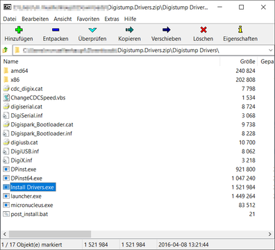
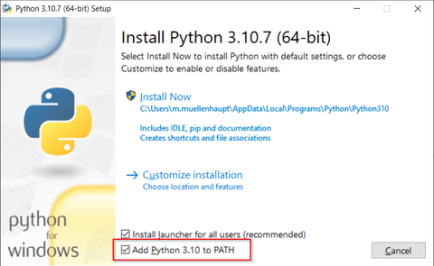
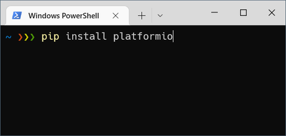

# Einrichtung der Programmierumgebung unter Windows

## 1. Installation des Treibers
Die Programmierung unter Windows benötigt die Installation [dieses Treibers](https://github.com/digistump/DigistumpArduino/releases/download/1.6.7/Digistump.Drivers.zip).



## 2. Installation Platformio
Am einfachsten lässt sich der Microcontroller mit Hilfe von [Platformio](https://platformio.org/) programmieren.

Dazu installiere bitte [Python](https://www.python.org/downloads/windows/). Und setze das Häkchen um Python im PATH zu registrieren:


Jetzt öffne eine Konsole (z.B. cmd.exe oder Powershell oder Windows Terminal) und installiere Platformio mit dem Befehl
```
pip install platformio
```

