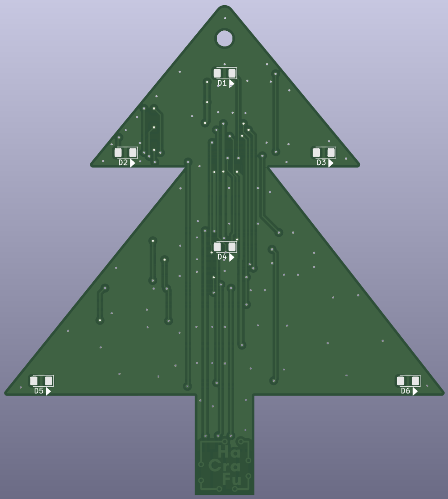

# Beschreibungen der HaCraFu Bausätze

[Bau(m)satz](KitBaumsatz.md)

[Unicorn](KitUnicorn.md)

[Unicorn S](KitUnicornS.md)

# Programmierung der HaCraFu Bausätze

[Bau(m)satz](KitBaumsatz.md) und [Unicorn](KitUnicorn.md) lassen sich selbst programmieren. Unter Windows musst du zunächst [diese Schritte](ProgSetupWindows.md) durchführen.

Lade dir dann [unsere Quelldateien](https://github.com/HaCraFu/assembly-kits/archive/refs/heads/main.zip) herunter und entpacke sie.

Du kannst jetzt [vorhandene Beispielprogramme ausprobieren](ProgExamples.md) oder [eigene Programme entwickeln](ProgCreateNew.md).