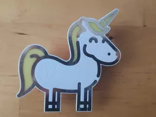

Der Verein Hacken Craften Funken e.V. entwickelt mehrere Bausätze:

[Unicorn S](kits/unicorn_s.md)

[Bau(m)satz](kits/baumsatz.md)

[Unicorn](kits/unicorn.md)

[Unicorn](kits/owlthief.md)

## Programmierung

[Bau(m)satz](kits/baumsatz.md) und [Unicorn](kits/unicorn.md) lassen sich selbst programmieren. Unter Windows musst du zunächst [diese Schritte](programming/avr/index.md) durchführen.

Lade dir dann [unsere Quelldateien](https://github.com/HaCraFu/assembly-kits/archive/refs/heads/main.zip) herunter und entpacke sie.

Du kannst jetzt [vorhandene Beispielprogramme ausprobieren](programming/avr/examples.md) oder eigene Programme entwickeln.